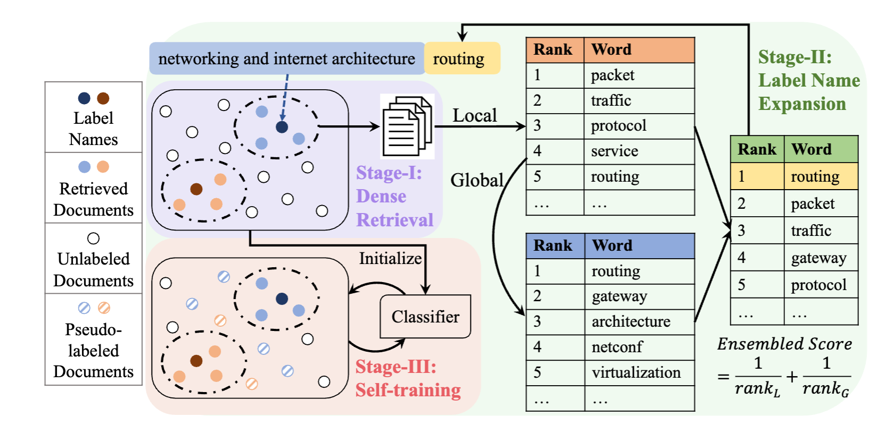

# WANDER

[SIGIR 2023] This is the code for our paper `Weakly-Supervised Scientific Document Classification via Retrieval-Augmented Multi-Stage Training'.

# Model Framework



# Data
The weakly labeled datasets, including unlabeled training data, testing data, label names, as well as the expanded label names are in here: [dataset](https://drive.google.com/file/d/1drdcJHm3AzFcLdzi0gd4saVIMGdiGsNp/view?usp=sharing). The statistics of dataset is summarized as follows:
| Dataset | MeSH | arXiv-CS | arXiv-Math | 
| ------ | ------- | ----- | ----------- |
| Type | Topic | Sentiment | Sentiment |  
| # of Train  | 16.3k | 75.7k |  62.5k  | 
|# of Test  | 3.5k | 5.1k | 6.3kk | 
| # OOV Label Names | 4 (36%) | 5 (25%)  | 3 (19%) | 

# Model 
We have uploaded the dense retrieval after pretraining at [this link](https://drive.google.com/file/d/1drdcJHm3AzFcLdzi0gd4saVIMGdiGsNp/view?usp=sharing) following the code in [this link](https://github.com/OpenMatch/COCO-DR/tree/main/COCO) and [this link](https://github.com/luyug/Condenser). Note that we use the the embedding of the [CLS] token as the sequence embeddings.

# Package 
- PyTorch 1.8
- python 3.7
- Transformers 4.6.0
- tqdm
- nltk
- MulticoreTSNE

# Code
- `gen_embedding.py`: the main code to produce sequence embeddings. We have provided the embedding generated with our checkpoint at [this link]().
- `dense_retrieval.py`: the main code to run the retrieval module.
- `keyword_expansion.py`: the keyword expansion module with local and global context. 
- `main.py` and `trainer.py`: the main code for classifier training.

# Training Procedures
## Step 1: Retrieving Initial Documesnts
```
python faiss_knn.py --dataset=wos --model=${DR_model} --gpuid=2 --round=0 --type=train --target=wos --N=$N --prompt_id=0
```

## Step 2: Classifier Training
```
bash commands/run_classifier.sh
```
Parameter Setting:
- `task`: the downstream dataset
- `round`: the retrieval rounds (set it to `0` in this time)
- `semi_method`: the type of learning (finetune or self-training), set to `ft` this time
- `lr`: the learning rate
- `batch_size`: the batch size in training
- `gpu`: allocate the GPU resource to speed up training.

## Step 3: Label Name Expansion
In this step (stage-II in the paper), local and global information are used to select keywords to augment the label names for each class.
```
ROUNDS=6
TARGET=mesh
DR_model=arxiv_ckpt
loc=1
glo=1
for ((i=0;i<${ROUNDS};++i)); do 
echo "Dataset ${TARGET}, DR Model: ${DR_model}, Round${i}, local ${loc}, global ${glo}"
python keyword_expansion.py --dr_model=${DR_model} --topN=$N --round=$i --target=${TARGET} --loc=${loc} --glo=${glo}
python faiss_knn.py --dataset=${TARGET} --model=${DR_model} --gpuid=0 --round=$(($i+1)) --type=train --N=$N --prompt_id=0  --loc=${loc} --glo=${glo}
done 
```

## Step 4: Classifier Training/Self-training
In this step, you need to first fine-tune classifiers using the documents retrieved with expanded label names in *step 3*. After that, you can use self-training to further refine the classifiers on all unlabeled corpus. 
```
bash commands/run_classifier.sh
```
Parameter Setting:
- `task`: the downstream dataset
- `round`: the retrieval rounds (set it to `${the_number_of_dense_retrieval_rounds}` in this time)
- `semi_method`: the type of learning (finetune or self-training), set to `ft` for fine-tuning and `st` for self-training. Normally we need to first finetune the model, then use the finetuned model as the starting points for self-training.
- `lr`: the learning rate
- `batch_size`: the batch size in training
- `gpu`: allocate the GPU resource to speed up training.
- For self-training, you need to set the `load_prev` to 1 and set the `prev_ckpt` to the checkpoints obtained from the previous fine-tuning step.
  
# Questions?
If you have any questions, feel free to reach out to `ran.xu at emory.edu`. Please try to specify the problem with details so we can help you better and quicker!

# Citation
If you find this repository valuable for your research, we kindly request that you acknowledge our paper by citing the following paper. We appreciate your consideration.
```
@inproceedings{xu2023weakly,
  title={Weakly-Supervised Scientific Document Classification via Retrieval-Augmented Multi-Stage Training},
  author={Xu, Ran and Yu, Yue and Ho, Joyce C and Yang, Carl},
  booktitle={Proceedings of the 46th International ACM SIGIR Conference on Research and Development in Information Retrieval},
  year={2023}
}
```